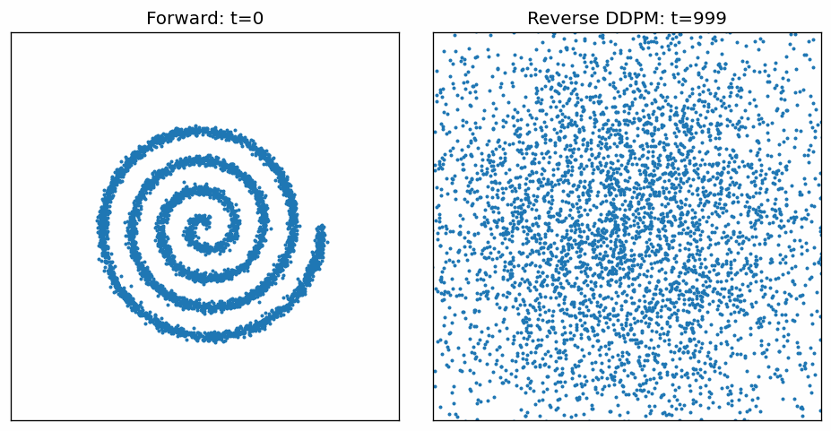
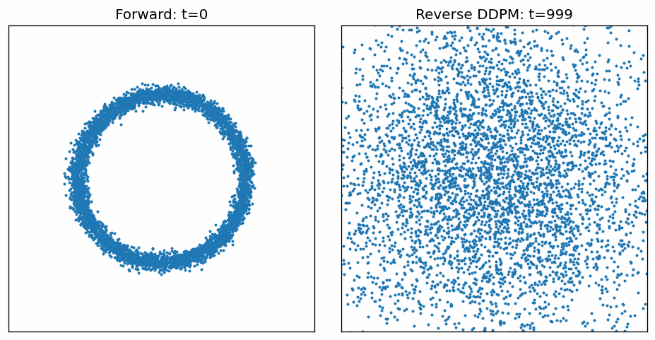
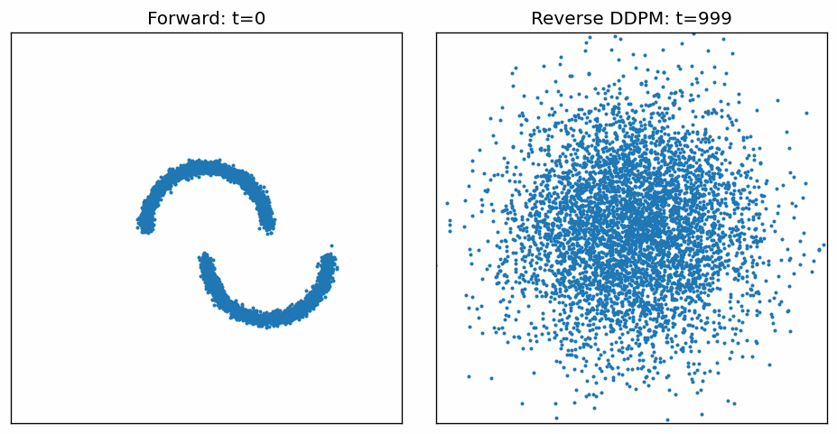

# Fundamentals of Diffusion via 2D Toy Data  

**NOTE:** Simple Diffusion model for 2D data.  

The code is originally written in notebooks/2D_Diffusion.ipynb. It has detailed information about each step of the diffusion process (math and reasoning) along with comments in the code. The repo is simply the code present in the notebook organized.  

[](https://colab.research.google.com/github/fin1cky/2D-Diffusion/blob/main/notebooks/2D_Diffusion.ipynb)

## Forward + Reverse Diffusion

### Spiral


### Circle


### Moons


Goal: Develop an intuition for diffusion models by implementing DDPM training + DDPM/DDIM sampling from scratch on simple 2D distributions.

**Datasets**
- Circles, two-moons, and an Archimedean spiral (with small additive noise to avoid an infinitely thin manifold).

**Forward process**
- Cosine schedule to define $\beta_t$ and cumulative signal $\bar{\alpha_t}$.
- Efficient noising using the closed-form marginal: $x_t = \sqrt{\bar{\alpha_t}}x_{\theta} + \sqrt{(1-\bar{\alpha_t})} \epsilon$.

**Model + objective**
- Sinusoidal timestep embeddings.
- MLP denoiser predicting $\epsilon_{\theta}(x_t, t)$ trained with MSE($\epsilon_{\theta}, \epsilon$).
- Sample a different timestep t for each datapoint in the batch to cover many noise levels per minibatch.

**Sampling**
- DDPM: sample $x_{t-1} \sim N(\mu_{\theta}(x_t,t), \tilde{\beta_t}I)$ to generate points from pure Gaussian noise.
- DDIM: deterministic, timestep-skipping sampler for faster generation.
- Temperature sweep: scale reverse noise by $\gamma$ to study sharpness vs diversity and observe deterministic mode-seeking behavior at $\gamma \to 0$.

**Outputs**
- Qualitative plots showing forward noising progression and successful generation for circles/moons/spiral under DDPM/DDIM, plus $\gamma$-sweep visualizations.

## Training

Train a DDPM model on a 2D dataset:

```bash
python -m scripts.train --dataset circle
```

Available datasets: `circle`, `moons`, `spiral`

| Flag | Default | Description |
|---|---|---|
| `--dataset` | `circle` | Dataset to train on |
| `--steps` | `5000` | Number of training steps |
| `--batch-size` | `2048` | Batch size |
| `--lr` | `2e-4` | Learning rate |
| `--print-every` | `500` | Log loss every N steps |
| `--save-weights` / `--no-save-weights` | `True` | Save model weights to `model_{dataset}.pt` |
| `--save-plots` / `--no-save-plots` | `True` | Save loss curve to `plots/` |

## Sampling

Generate samples from a trained model:

```bash
python -m scripts.sample --dataset circle
```

Loads weights from `model_{dataset}.pt` by default. Runs DDPM (full 1000 steps), DDIM (100 steps), and a gamma sweep to visualize the effect of stochasticity.

| Flag | Default | Description |
|---|---|---|
| `--dataset` | `circle` | Dataset the model was trained on |
| `--weights` | `model_{dataset}.pt` | Path to model weights |
| `--n` | `5000` | Number of samples to generate |
| `--ddim-steps` | `100` | Number of DDIM denoising steps |
| `--save-plots` / `--no-save-plots` | `True` | Save sample plots to `plots/` |

Plots saved to `plots/`: `ddpm_samples_{dataset}.png`, `ddim_samples_{dataset}.png`, `gamma_sweep_{dataset}.png`

## REFERENCES

[1] Denoising Diffusion Probabilistic Models - Ho et al.  
[2] Improved Denoising Diffusion Probabilistic Models - Alex Nichol and Prafulla Dhariwal  
[3] Attention Is All You Need - Vaswani et al.  
[4] Denoising Diffusion Implicit Models - Song et al.

ChatGPT 5.2 Thinking, Claude Opus 4.6
